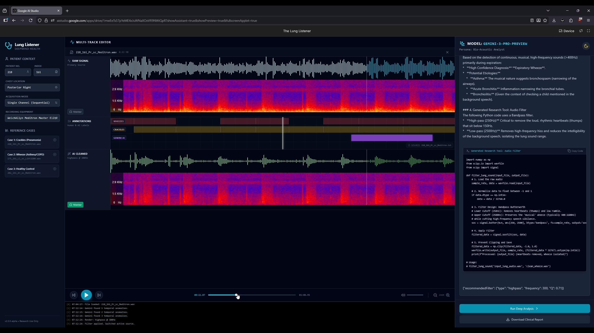

<div align="center">
  
  <h1>The Lung Listener</h1>
  <h3>Vibe Coding a Digital Pulmonologist with Gemini 3 Pro</h3>

  <p>
    <a href="https://aistudio.google.com/apps/drive/1mwEeTs57pYeME4xJuWNaXOxVR9NWiQpR?fullscreenApplet=true&showPreview=true&showAssistant=true">
      
    </a>
    <a href="https://www.youtube.com/watch?v=DeplSlKUGN4">
      
    </a>
  </p>

  <p>
    
    
  </p>
</div>

---

## 🫁 Overview

**The Lung Listener** is a bio-acoustic research instrument designed to turn subjective lung sounds into objective, actionable data. 

Respiratory disease is the 3rd leading cause of death worldwide, yet diagnosis often relies on the subjective human ear. This tool uses **Gemini 3 Pro’s native multimodality** to "hear" raw clinical audio buffers, visualize pathologies, and generate custom DSP filters to isolate signals from noise.

> **Note to Judges:** This project was "Vibe Coded" in Google AI Studio in under 5 days, utilizing the Gemini 3 Pro Preview model for native audio reasoning.

---

## 🔬 Key Features

<div align="center">
  
</div>


### 1. Native Audio Analysis (No Transcription)
Unlike traditional wrappers that convert audio to text, The Lung Listener pipes the **Raw Audio Buffer** directly into `gemini-3-pro-preview`. This allows the model to detect non-speech textures like the "musicality" of a wheeze or the "percussive" nature of a crackle.

### 2. "Glass Box" Visualization
* **Real-time Mel-Spectrograms:** Powered by `wavesurfer.js` to visualize frequency intensity.
* **Ground Truth Overlay:** Displays human annotations (Yellow) vs. AI Predictions (Purple) to demonstrate precision.
* **Zoom & Isolate:** Users can inspect specific milliseconds of a breath cycle.

### 3. Actionable Filter Generation
The AI doesn't just diagnose; it acts. When noise is detected, Gemini generates **custom Python code** (High-pass/Band-pass filters) to clean the audio. The app visualizes this configuration and allows users to "Solo" the raw vs. filtered signal.

### 4. Reference Case Library
Includes a cloud-fetched library of "Gold Standard" cases (Pneumonia, COPD, Healthy) from the ICBHI dataset, allowing for instant testing without file downloads.

---

## 🛠️ Tech Stack

* **Model:** `gemini-3-pro-preview` (Native Multimodality)
* **Platform:** Google AI Studio (Vibe Coding Workflow)
* **Frontend:** React 18, Vite, TypeScript
* **Styling:** Tailwind CSS ("Clinical Dark Mode" aesthetic)
* **Audio Engine:** Web Audio API, `wavesurfer.js`
* **SDK:** Google Generative AI SDK for Web

---

## 🚀 How to Run

### Option 1: Quick Start (Google AI Studio) - **Recommended**
The fastest way to test the app is directly in the browser.

1.  **Click the Project Link:** [Lung Listener](https://ai.studio/apps/drive/1mwEeTs57pYeME4xJuWNaXOxVR9NWiQpR)
2.  **Sign In:** Log in with your Google Account to enable the Vibe Coding environment.
3.  **Run:** Click the "Run" or "Preview" button. The app should function immediately using your account's free tier quota.

> **⚠️ Note:** If you encounter a `429 Resource Exhausted` error, please **Fork** the project and add your own API Key in the "Secrets" tab to bypass the shared rate limit.
---

### Option 2: Run Locally (Developer Mode)
If you prefer to run the codebase on your local machine:

**Prerequisites:** Node.js (v18+) and a Google Gemini API Key.

1.  **Clone the Repository**
    ```bash
    git clone [https://github.com/kingkw1/lung-listener.git](https://github.com/kingkw1/lung-listener.git)
    cd lung-listener
    ```

2.  **Install Dependencies**
    ```bash
    npm install
    ```

3.  **Configure Environment & API Key**
    * Create a `.env.local` file in the root directory.
    * Add your API key (ensure the variable name matches your code):
        ```env
        VITE_GEMINI_API_KEY=your_actual_api_key_here
        ```
    * *(Note: You may need to update the code to use import.meta.env.VITE_GEMINI_API_KEY if running with Vite locally)*
    * *(Note: The app requires a valid key to perform Deep Analysis)*

4.  **Start App**
    ```bash
    npm run dev
    ```
    * Open `http://localhost:5173` (or the port shown in terminal).

---

## 📂 Project Structure

```text
├── components/          # Core React UI components
│   ├── AudioPlayer.tsx
│   ├── CenterStage.tsx
│   ├── DebugLog.tsx
│   ├── ...
├── docs/                # Project documentation and planning
├── submission_materials/# Hackathon submission assets
├── App.tsx              # Main application entry point
├── index.html           # HTML entry point
├── index.tsx            # React DOM rendering
├── package.json         # Dependencies and scripts
├── tsconfig.json        # TypeScript configuration
├── types.ts             # Shared TypeScript interfaces
└── vite.config.ts       # Vite build configuration
```

## 📚 Data Source
This project utilizes data from the **ICBHI 2017 Respiratory Sound Database** (International Conference on Biomedical and Health Informatics).

## 📄 License
This project is licensed under the **Apache 2.0 License** - see the [LICENSE](LICENSE) file for details.